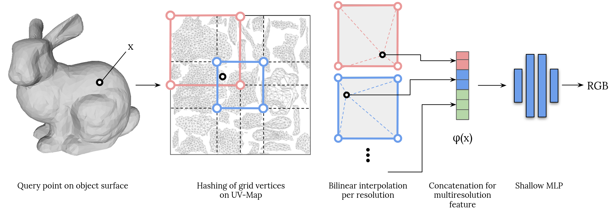

# Instant-UV: Fast Implicit Texture Learning for 2D Mesh Rendering


# Abstract 
Multiresolution feature grid encodings have been shown to significantly accelerate neural representations due to the requirement of smaller MLPs. In this work, we introduce Instant-UV, a novel method for representing texture on meshes that blends multiresolution grid encodings with traditional UV mapping. We evaluate our method on the multi-view texture reconstruction task and show a speedup of over a magnitude to baseline methods while not dependent on the mesh resolution.

# Work with InstantUV

## Install packages

```bash
# I have tested it with python=3.9, but might also work with newer version
conda create -n instantuv python=3.10
conda activate instantuv
```

```bash
pip install -r requirements.txt
pip install pyembree # not sure why this fails when downloading through requirements.txt
```

## Download the data
The data will be downloaded under `data/raw`. Please don't change its download location, as the preprocessing script will pick it up from there. 
```bash
./src/data/download_data.sh
```

## Preprocess the data
Preprocess the data by performing ray-mesh intersection given the images and the mesh object. Here we separately preprocess train, val and test data, for which we defined the split beforehand. The following command preprocesses the data for the human object for the train split. Do this for the `val` split as well and repeat the process for the `cat` object. Note, that we dont need to preprocess the test dataset, since we run our evaluations on rendered images directly.
```bash
python src/data/preprocess_dataset.py --config_path config/human/config_human.yaml --split train
```
Tipp: Run the preprocessing with the [`nice`](https://man7.org/linux/man-pages/man2/nice.2.html) command, since it is very cpu intensive and your laptop might crash. 


## Train model
Using the preprocessed data you can train the model on eg. the human object by running
```bash
python src/model/train.py --config_path config/human/config_human.yaml
```

## Visualize
For now during training, for every eval step, all the views in the val data-split will be rendered into the render/ directory :)

## Run experiments

Refer to `src/experiments/experiments.py`. Here we have defined some functions which you can run to reproduce the results in our paper. 
### Note for using wandb:
If `training>use_wandb` is set in (config.yaml) an .env file must be created in `src/.env` with WANDB_API_KEY=<<your-key>>

